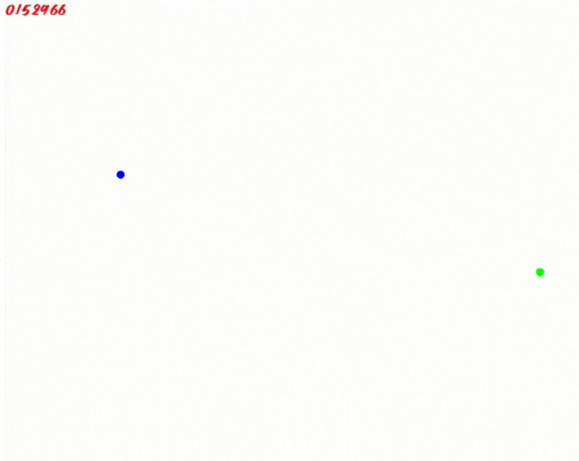

# HPC N-Body Simulation Project

The purpose of this project is to perform N-Body Simulations on classical objects, in order to test different methodologies for scheme of discretisation and implementation of parallelism. The objective is to apply High Performance Computing techniques to N-Body algorithms and test the results in terms of computational performance and model accuracy.

The program is intended to be run on some massive HPC clusters currently available to the authors.

This project is pedagogical in nature, and part of the intent is to demonstrate the principles of N-Body and HPC in a clear fashion.

## Output demo (with SFML)

## Proof of concept

The first test (proof of concept) for the project consists of a two body simulation using the Euler integration scheme. The simulation uses arbitrary units for every quantity, but the values used correspond to the order of magnitude of celestial bodies in the solar system in astronomical units. The simulation produces as output a `.out` file containing the values of the positions of the two bodies at every step, as well as the corresponding time.

To compile: use provided makefile.

*Judging from the output, the simulation does not seem to be working properly: there is no change in the positions*

## Theoretical Background

*This section should contain the theoretical background on N-Body problems, N-Body algorithms, and Parallelization*

### On N-Body Problems

**Newton's equation of motion**

$$ \vec{F} = \sum_i m\vec{a}_i $$

**Law of Universal Gravitation**

$$ \vec{F}_i = \sum_j \frac{G m_i m_j}{ |\vec{r}_j - \vec{r}_i |^2 } \hat{r}_{ji} $$

$$ \vec{a}_i = \sum_j G m_j \frac{\vec{r}_j - \vec{r}_i }{|\vec{r}_j - \vec{r}_i |^3 } $$

### On N-Body Algorithms

$$ r_{i+1} \approx r_{i} + \frac{\partial r}{\partial t} \Delta t $$
